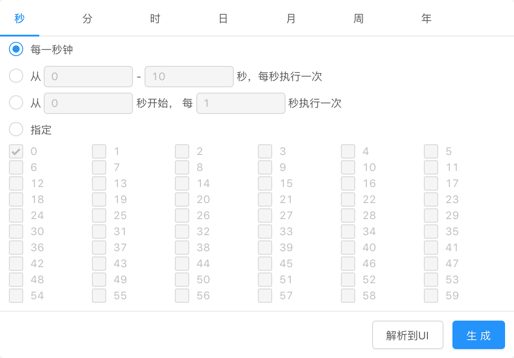

<div align="center">
    <h1>ReactCron</h1>
    <div>基于React及Antd的cron时间表达式生成器</div>
    <br/>
    
</div>


### 特性
- 🎉 全面支持cron：秒、分、时、日、月、周、年
- 🎉 日及周条件互斥，自动改变响应值
- 🎉 支持反解析cron表达式到UI
- 🎉 可结合此组件与Antd的下拉及输入组件封装成下拉输入框


### 案例
封装一个用于表单组件的CronInput。

```jsx
import React, { PureComponent } from 'react';
import { Dropdown, Input } from 'antd';
import Cron from '@/components/Cron';

class CronInput extends PureComponent {
    onOk = (value) => {
        const { onChange } = this.props;
        if (onChange) {
            onChange(value);
        }
    };

    render() {
        const { style, inputStyle, value, ...passThroughProps } = this.props;

        return (
            <Dropdown
                trigger={['click']}
                placement="bottomLeft"
                overlay={<Cron onOk={this.onOk} value={value} style={style} />}
            >
                <Input.Search value={value} style={inputStyle} {...passThroughProps} />
            </Dropdown>
        );
    }
}
export default CronInput;
```

### LICENSE
MIT
